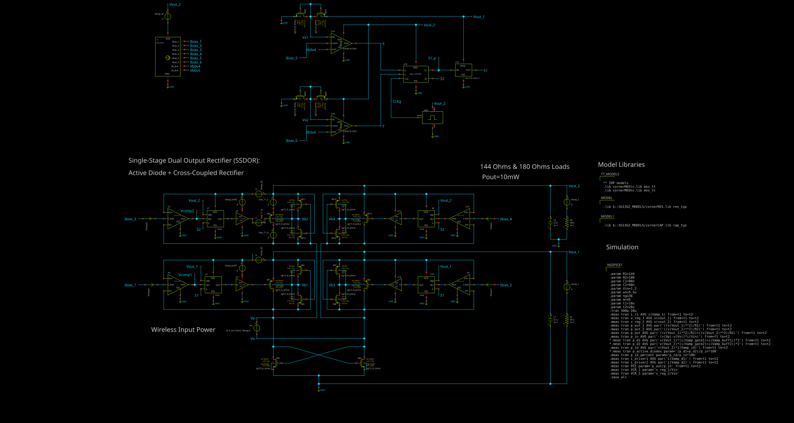
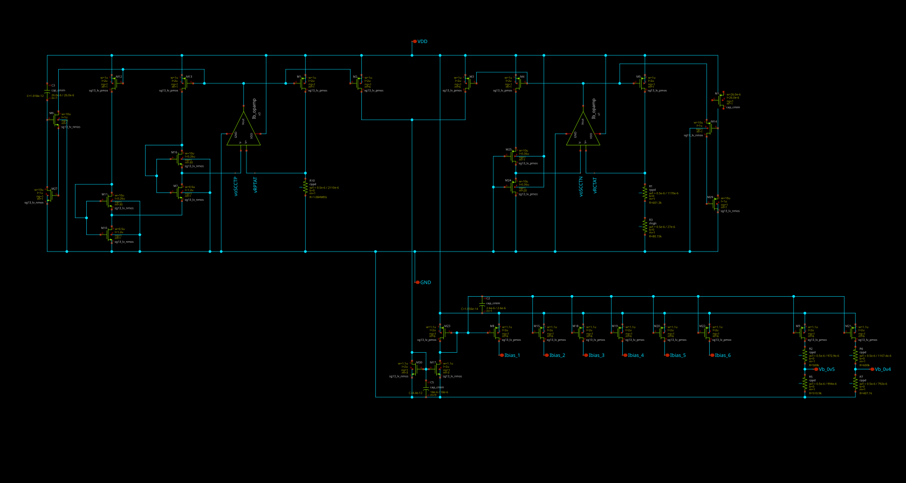
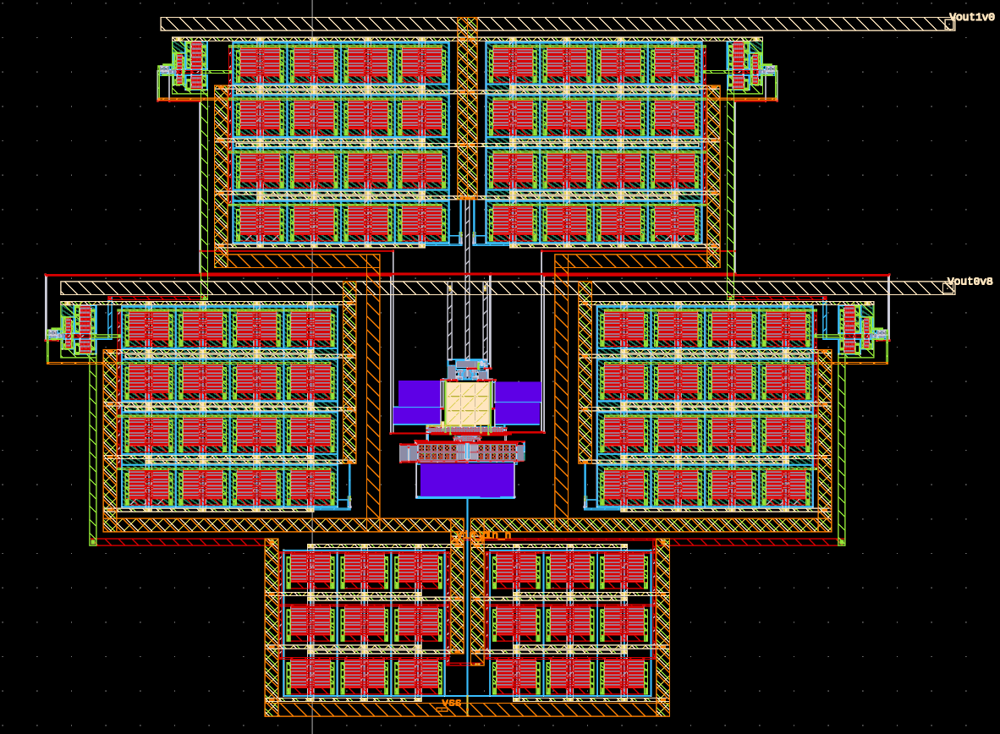

# SSDOR-UNICCASS-2025

## Single-Stage Dual-Output Rectifier

This repository contains the design and implementation of a **Single-Stage Dual-Output Rectifier (SSDOR)** developed as part of the **UNICCASS 2025 program**, supported by the **IEEE Circuits and Systems Society (IEEE CAS)**.

The project explores an integrated power-management solution for **wireless power transfer (WPT)** applications, targeting low-power and implantable electronic systems.

---

## Project Overview

The proposed **Single-Stage Dual-Output Rectifier (SSDOR)** converts a **13.56 MHz wireless power signal**, within the **NFC/ISM frequency band**, into two DC supply voltages:

* **1.0 V output**
* **0.8 V output**

The dual-output architecture is intended to provide multiple supply domains from a single wireless power receiver, reducing the need for independent power-conversion stages.

The main target application is **implantable biomedical electronics**, where compactness, power efficiency, and integration are important design constraints.

---

## Top-Level Architecture

The complete system integrates the rectifier together with the required **biasing and reference circuitry**.

The top-level architecture includes:

* Single-stage dual-output rectifier
* CTAT/PTAT reference circuit
* Reference current generation
* Voltage reference generation
* Biasing circuitry for the rectifier
* Dual DC output generation

The circuit is designed for operation from a **13.56 MHz wireless power transfer interface**.

### Top-Level Schematic



---

## CTAT/PTAT Reference Circuit

A dedicated **CTAT/PTAT reference circuit** is included to generate the bias conditions required by the SSDOR.

The reference block is based on a **Self-Cascode Composite** architecture and is designed to generate a reference current of approximately **6 µA**, together with voltage reference levels used by the main rectifier circuit.

The CTAT/PTAT approach combines temperature-dependent voltage components to obtain stable biasing and reference voltages. The generated reference current provides the bias required by the different circuit blocks while the voltage references are used to establish the desired operating points of the SSDOR.

### Main functions

* Generation of approximately **6 µA reference current**
* Generation of **CTAT/PTAT voltage references**
* Bias generation for the rectifier
* Improved control of the operating point of the main circuit
* Integration of the reference circuitry within the same IC design

### CTAT/PTAT Schematic



The reference circuit was designed together with the main SSDOR to ensure compatibility with the available supply voltage and the requirements of the rectifier architecture.

---

## Design Flow

The complete design was developed using an **open-source integrated circuit design flow**, including schematic capture, circuit simulation, physical layout, and verification.

### Tools and Technology

* **Schematic:** Xschem
* **Circuit simulation:** Ngspice
* **Layout:** KLayout
* **PDK:** IHP SG13G2 Open Source PDK
* **Technology:** IHP **130 nm SiGe BiCMOS**

The IHP SG13G2 technology is a 130 nm BiCMOS process supporting CMOS and SiGe:C bipolar devices, making it suitable for analog, mixed-signal, RF, and power-management circuits.

The design flow follows the main stages of an integrated circuit development process:

1. Circuit architecture definition
2. Schematic design
3. Circuit-level simulation
4. Transistor sizing and optimization
5. Physical layout
6. Design Rule Check (DRC)
7. Layout Versus Schematic (LVS)
8. Post-layout verification

---

## Schematic

The SSDOR receives a **13.56 MHz AC/RF signal** generated through wireless power transfer. The rectifier converts the received signal into DC power while providing two output voltage levels.

The reference circuitry provides the required bias current and voltage references for the main rectifier.

The complete system therefore combines **wireless power conversion and on-chip bias/reference generation** into an integrated architecture.

---

## Layout

The physical implementation is developed using the **IHP SG13G2 130 nm BiCMOS technology**.

The layout includes the rectifier core, reference circuitry, biasing structures, output structures, and the associated interconnect required for the dual-output architecture.

### Layout



---

## Target Specifications

| Parameter              |                               Target |
| ---------------------- | -----------------------------------: |
| Technology             |             IHP SG13G2 130 nm BiCMOS |
| Input frequency        |                            13.56 MHz |
| Application            |              Wireless Power Transfer |
| Output 1               |                                1.0 V |
| Output 2               |                                0.8 V |
| Reference current      |                                ~6 µA |
| Reference circuit      |                            CTAT/PTAT |
| Reference architecture |               Self-Cascode Composite |
| Target application     | Implantable / biomedical electronics |
| Design flow            |                          Open-source |

---

## Motivation

Wireless power transfer is particularly attractive for implantable and miniature biomedical devices because it can reduce the dependence on conventional batteries and wired power connections.

However, implantable systems often require **multiple supply voltages** for different circuit blocks. Generating these voltage domains efficiently from a single wireless power interface is therefore an important design challenge.

The SSDOR investigates an integrated solution capable of generating multiple DC supply levels while maintaining a compact single-stage power-conversion architecture.

The inclusion of an integrated **CTAT/PTAT reference and bias circuit** further enables the generation of the currents and voltage references required for stable circuit operation.

---

## Repository Structure

```text
SSDOR-UNICCASS-2025/
│
├── images/
│   ├── SSDOR_1.2V_v3.svg
│   ├── CTAT_PTAT.svg
│   └── top_ss_1.png
│
├── schematic/
│
├── simulation/
│
├── layout/
│
├── verification/
│
└── README.md
```

---

## Program

This project was developed as part of the **UNICCASS 2025 program**, an initiative of the **IEEE Circuits and Systems Society (IEEE CAS)** focused on providing students with hands-on experience in integrated circuit design and semiconductor technologies.

---

## Authors

**UNICCASS 2025 — SSDOR Project Team**

* Rodrigo Marin
* Rodrigo Herrera
